# FLOWER--SHOP

## LIVE SITE

Live website:
https://hamid-aa80.github.io/Flower--Shop/
Repository:
https://github.com/Hamid-aa80/Flower--Shop.git
## PROJECT purpose

The project purpose for a flower shop is to establish a viable retail and design business that delivers high-quality floral products and exceptional experiences to fulfill the community's emotional, celebratory, and decorative needs. It bridges the gap between local growers and consumers, turning perishable inventory into meaningful, artistic customer connections.

- Emotional Connection: Helping customers express love, sympathy, gratitude, and celebration through the universal language of flowers.
- Aesthetic & Design Excellence: Providing expert floral artistry, custom arrangements, and event styling that standard supermarkets cannot replicate.
- Community & Sustainability: Sourcing reliable, fresh blooms from local growers to support the regional economy and promote sustainable agricultural practices.
## target audience
The target audience for a flower shop consists of consumers purchasing for emotional expression, event planners requiring large-scale decor, and corporate clients seeking regular space styling. 

- Holiday & Occasion Shoppers: Customers buying for Valentine's Day, Mother's Day, anniversaries, and birthdays.
- Expression Shoppers: Individuals purchasing arrangements to express specific emotions, such as sympathy, romantic love, congratulations, or "get well" wishes.
- Self-Care Buyers: People who buy affordable bunches or potted plants strictly to decorate their own homes or improve their mental well-being.
- Last-Minute Impulse Buyers: Foot traffic customers needing a quick, pre-made bouquet on their way to a dinner party or date.

## User goals 
represent the specific needs, desires, and tasks that customers hope to accomplish when interacting with a flower shop. 

- Evoke an emotion: Trigger a specific feeling in the recipient, such as love, sympathy, comfort, or joy.
- Ensure perfect timing: Have the flowers arrive exactly on the specific date, such as a birthday or anniversary.
- Send fresh product: Guarantee the arrangement looks pristine and lasts for days after delivery.
- Personalise the gift: Add a custom card message, preferred color palette, or specific flower varieties.

## Business and site owner goals 
focus on driving profitability, operational efficiency, and brand loyalty. 

- Maximise Average Order Value : Use smart upselling to encourage customers to add premium vases, chocolates, candles, or larger bouquet sizes during checkout.
- Secure Recurring Revenue: Drive predictable income by promoting weekly, monthly, or holiday-based floral subscription models for both homes and businesses.

## User stories
- As a last-minute shopper,
 * I want to filter arrangements by "available for same-day delivery"So that I can guarantee my anniversary gift arrives on time today.
- As a sentimental sender,
* I want to type a custom message into a digital greeting card during checkoutSo that the recipient knows exactly who the flowers are from and why.
- As a forgetful partner,
  * I want to opt-in to annual calendar reminders for my spouse's birthdaySo that the system automatically alerts me a week in advance every year.

## features
- Responsive navigation bar
- Image gallery section
- Date and time selection inputs
- Confirmation/success message after submission
- Social media icons in footer
- Custom favicon

## Future Features

- Online payments
- Customer testimonials
- Availability calendar
- Request a flower
- Booking management system
## PROJECT BOARD

A Github Project Board was used to manage development and track my user story tasks.

I created the project board by using the following steps:

1. Click New Project
2. Select Board
3. Enter the project name
4. Click Create Project
5. Then added each user story with the must haves, should haves, and could haves

The board was structured into columns:

- To Do - Featured tasks
- In Progress - Tasks that are being worked on
- Done - Completed tasks

## Wireframes

My wireframes were created using Figma at the start of my project to plan the layout and structure of my website. This helped to plan the content, placement and navigation before applying design and writing my codes. As you will see I decided to incorporate the About section onto my homepage to reduce load times and simplify navigation and improve mobile usability.

### Wireframe screenshots

### Mobile Device

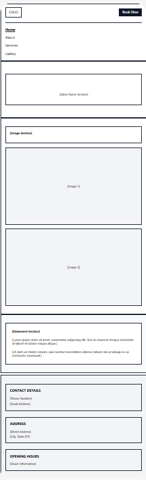 
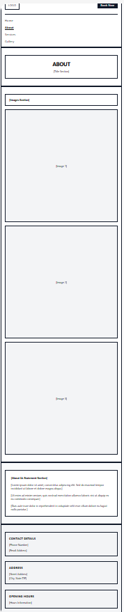 
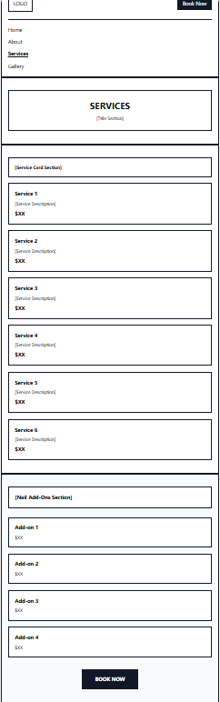 
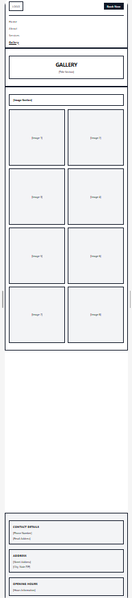

### Tablet Device
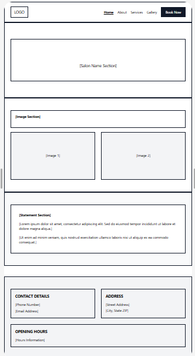 
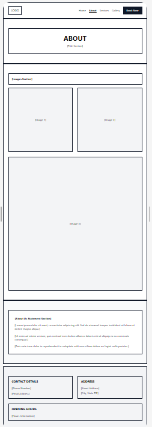 
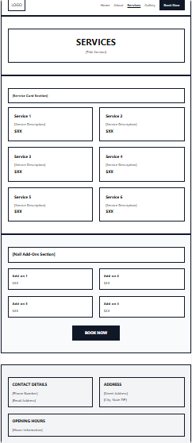 
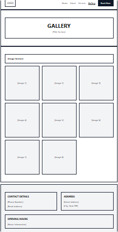

### Desktop Device
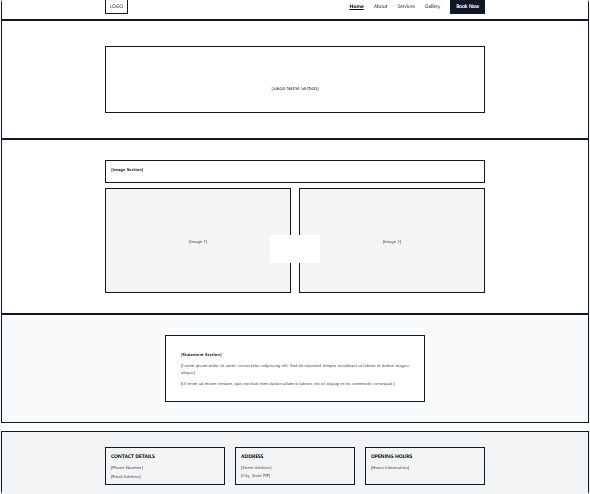 
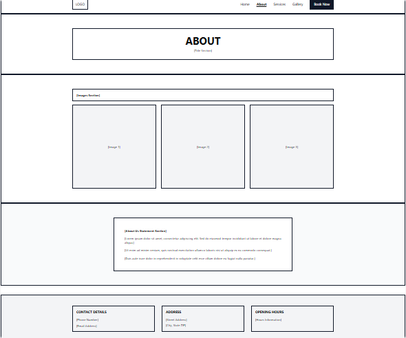 
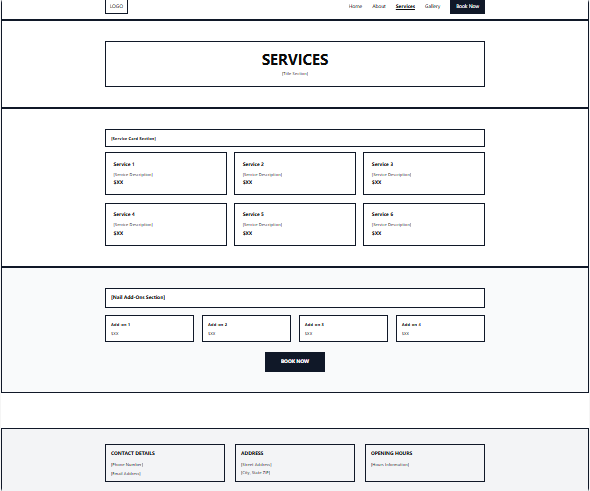 
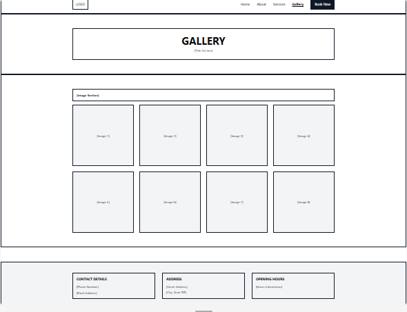

## Color Scheme

- '#e84393'

### Color Palette  

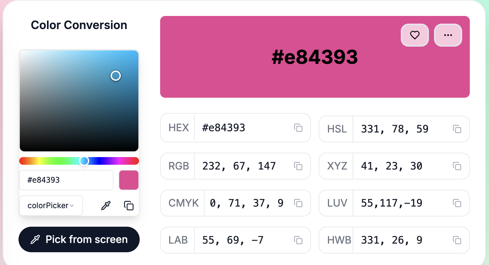

## Contrast Checker 
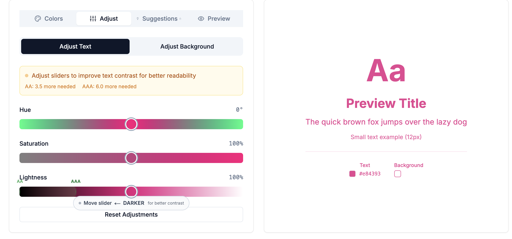
## Technologies Used

- HTML
- CSS
- Visual Code
- Bootstrap V5
- Google Fonts
- Github
- Figma for wireframes
- Adobe Firefly to generate photos
- Adobe Express to resize images
- FontAwesome
- Favicon
- Contrast Checker
- TinyPNG to convert images to webp

## TESTING

### Manual Testing

- Made sure all navbar links scroll to correct pages
- Responsiveness was tested using DevTools
- Layouts were verified on mobile, tablet, and desktop
- Service cards display in four columns on larger screens and stack correctly on smaller screens
- The booking form has the required fields to prevent empty submission
- The date and time inputs function correctly
- The confirmation message appears after booking submission

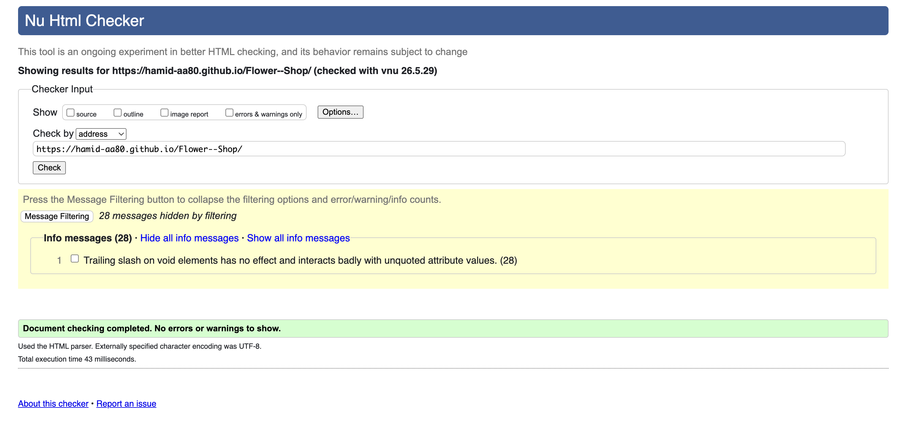
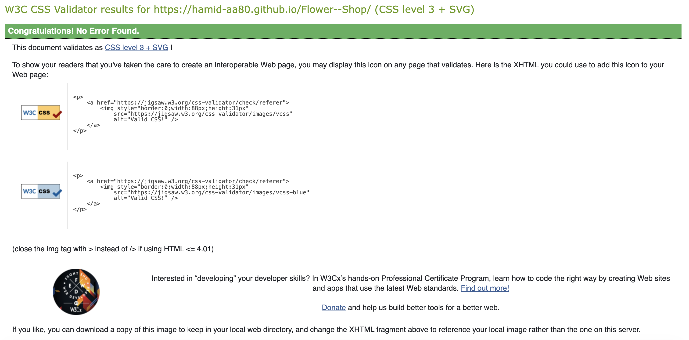

My project was deployed using Github:

1. My project was pushed to Github

2. Repository settings was selected

3. Pages section was selected

4. The main branch was chosen as the deployment source

5. Github generated the live site URL

## SCREENSHOTS

### Navbar

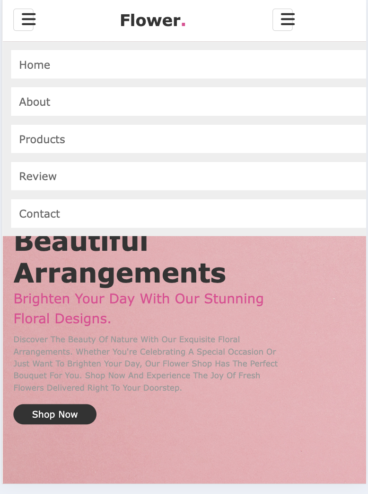

### Homepage

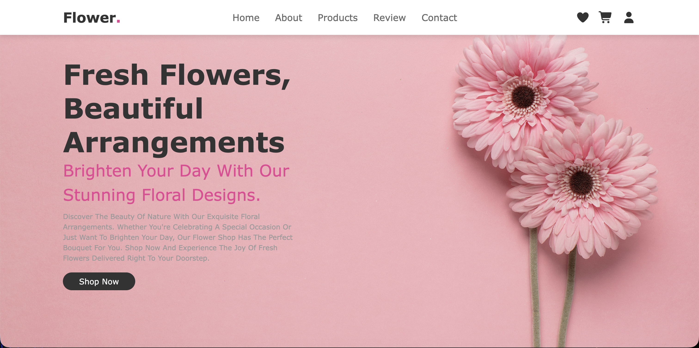

### About page

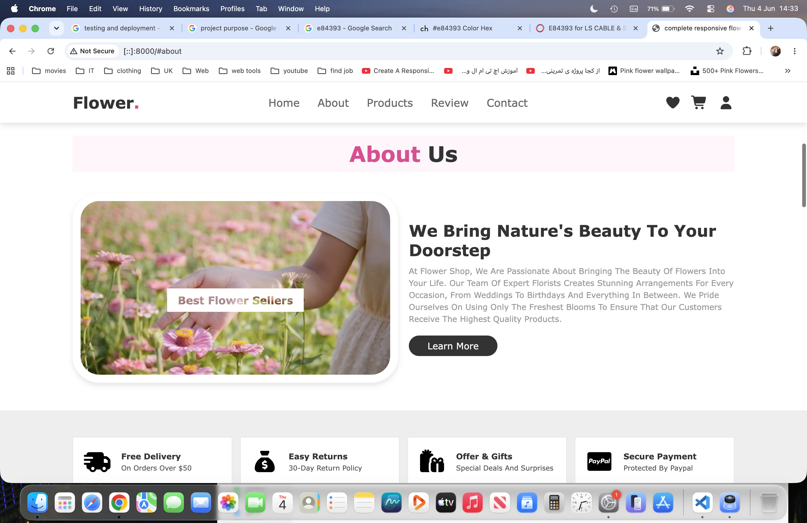

### Products Page

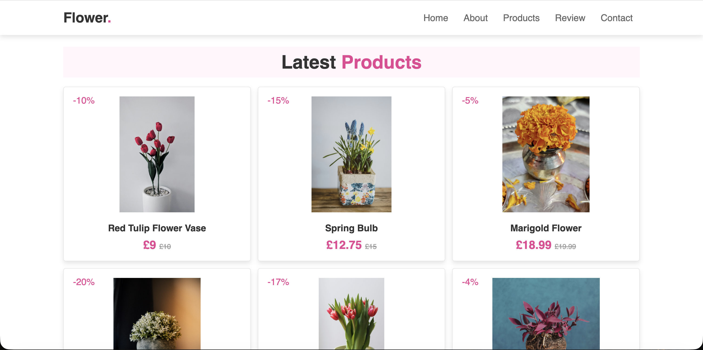

### review Page 

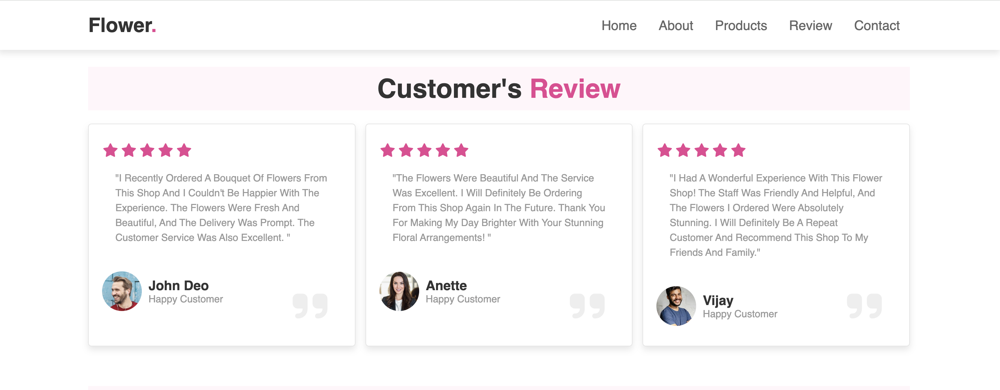

### Contact page

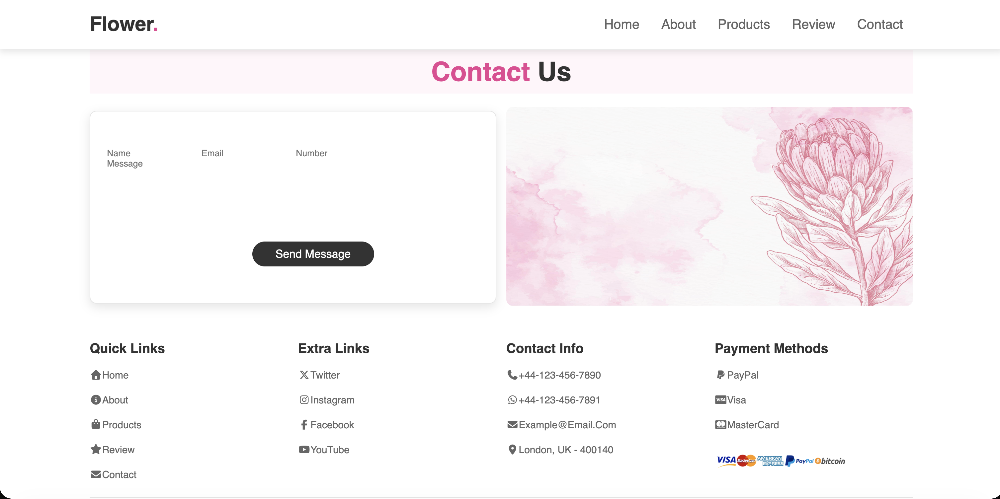
