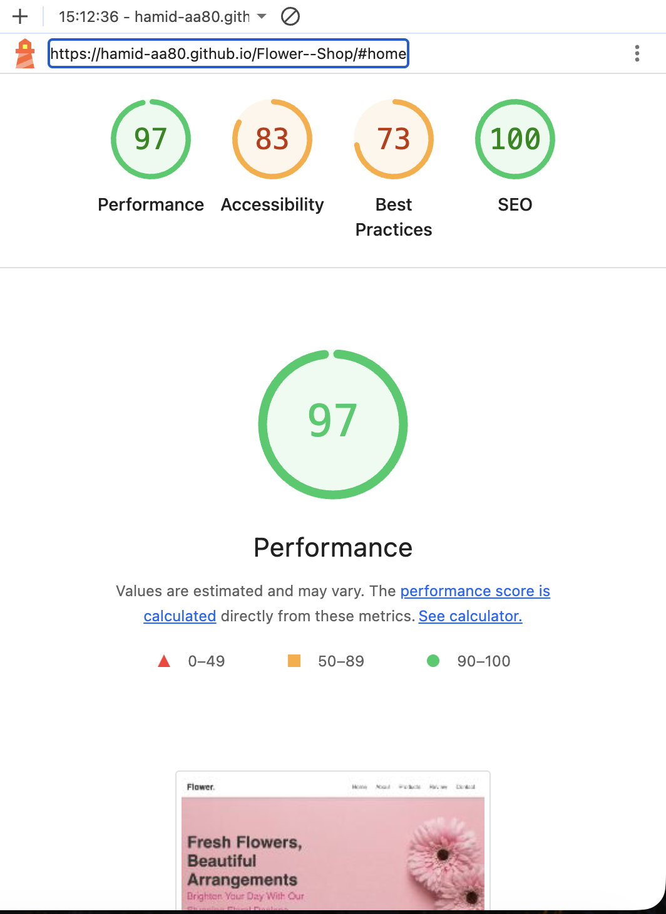
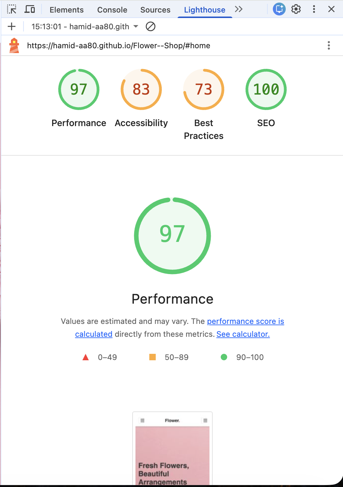
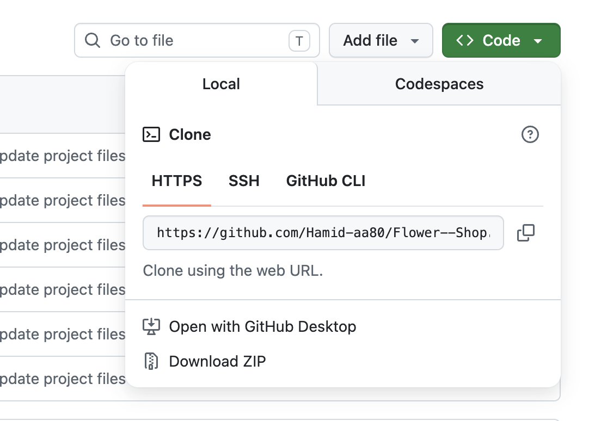

# FLOWER--SHOP

## LIVE SITE

Live website:
https://hamid-aa80.github.io/Flower--Shop/
Repository:
https://github.com/Hamid-aa80/Flower--Shop.git

## PROJECT purpose

The project purpose for a flower shop is to establish a viable retail and design business that delivers high-quality floral products and exceptional experiences to fulfill the community's emotional, celebratory, and decorative needs. It bridges the gap between local growers and consumers, turning perishable inventory into meaningful, artistic customer connections.

- Emotional Connection: Helping customers express love, sympathy, gratitude, and celebration through the universal language of flowers.
- Aesthetic & Design Excellence: Providing expert floral artistry, custom arrangements, and event styling that standard supermarkets cannot replicate.
- Community & Sustainability: Sourcing reliable, fresh blooms from local growers to support the regional economy and promote sustainable agricultural practices.

## target audience

The target audience for a flower shop consists of consumers purchasing for emotional expression, event planners requiring large-scale decor, and corporate clients seeking regular space styling.

- Holiday & Occasion Shoppers: Customers buying for Valentine's Day, Mother's Day, anniversaries, and birthdays.
- Expression Shoppers: Individuals purchasing arrangements to express specific emotions, such as sympathy, romantic love, congratulations, or "get well" wishes.
- Self-Care Buyers: People who buy affordable bunches or potted plants strictly to decorate their own homes or improve their mental well-being.
- Last-Minute Impulse Buyers: Foot traffic customers needing a quick, pre-made bouquet on their way to a dinner party or date.

## User goals

represent the specific needs, desires, and tasks that customers hope to accomplish when interacting with a flower shop.

- Evoke an emotion: Trigger a specific feeling in the recipient, such as love, sympathy, comfort, or joy.
- Ensure perfect timing: Have the flowers arrive exactly on the specific date, such as a birthday or anniversary.
- Send fresh product: Guarantee the arrangement looks pristine and lasts for days after delivery.
- Personalise the gift: Add a custom card message, preferred color palette, or specific flower varieties.

## Business and site owner goals

focus on driving profitability, operational efficiency, and brand loyalty.

- Maximise Average Order Value : Use smart upselling to encourage customers to add premium vases, chocolates, candles, or larger bouquet sizes during checkout.
- Secure Recurring Revenue: Drive predictable income by promoting weekly, monthly, or holiday-based floral subscription models for both homes and businesses.

## User stories

- As a last-minute shopper,

* I want to filter arrangements by "available for same-day delivery"So that I can guarantee my anniversary gift arrives on time today.

- As a sentimental sender,

* I want to type a custom message into a digital greeting card during checkoutSo that the recipient knows exactly who the flowers are from and why.

- As a forgetful partner,
  - I want to opt-in to annual calendar reminders for my spouse's birthdaySo that the system automatically alerts me a week in advance every year.

## features

- Responsive navigation bar
- Image gallery section
- Date and time selection inputs
- Confirmation/success message after submission
- Social media icons in footer
- Custom favicon

## Future Features

- Online payments
- Customer testimonials
- Availability calendar
- Request a flower
- Booking management system

## Wireframes

My wireframes were created using Figma at the start of my project to plan the layout and structure of my website. This helped to plan the content, placement and navigation before applying design and writing my codes. As you will see I decided to incorporate the About section onto my homepage to reduce load times and simplify navigation and improve mobile usability.

### Wireframe screenshots

### Mobile Device

### Tablet Device

### Desktop Device

## Color Scheme

- '#e84393'

### Color Palette

## Contrast Checker

## Technologies Used

- HTML
- CSS
- Visual Code
- Bootstrap V5
- Google Fonts
- Github
- Figma for wireframes
- Adobe Firefly to generate photos
- Adobe Express to resize images
- FontAwesome
- Favicon
- Contrast Checker
- TinyPNG to convert images to webp

## TESTING

### Manual Testing

#### Functionality

| Test                         | Test Action                                                                                           | Excepted results                                                       | Test results |
| ---------------------------- | ----------------------------------------------------------------------------------------------------- | ---------------------------------------------------------------------- | ------------ |
| Enquiry form                 | Test navigation to enquiry form                                                                       | Navigation to enquiry form was easily accessible and easy to find      | PASS         |
| Test the enquiry form        | Does the enquiry form have the right fields for the correct data to be collected for new clients      | The enquiry form has the correct fields such as Name, Email, Phone etc | PASS         |
| Fill out enquiry form        | Fill out enquiry form, does it display a succes message or page                                       | Directed to a success page                                             | PASS         |
| Return button (success page) | Does the return button work on the success page properly                                              | The return button directs you back to the home page                    | PASS         |
| Navigation                   | Test the navigation back and forth from page to page. For example - home to gallery, home to projects | Navigation works correctly                                             | PASS         |

### W3C HTML Test

### W3C CSS Test

My project was deployed using Github:

1. My project was pushed to Github

2. Repository settings was selected

3. Pages section was selected

4. The main branch was chosen as the deployment source

5. Github generated the live site URL

### Lighthouse

#### (index.html) - Desktop

#### (index.html) - Mobile

## SCREENSHOTS

### Navbar

### Homepage

### About page

### Products Page

### review Page

### Contact page

## Deployment

This project was developed using [VScode](https://code.visualstudio.com/), commited to git and pushed to GitHub using the built in function within VScode.

This site is hosted using GitHub pages, deployed directly from the master branch. The deployed site will update automatically upon new commits to the master branch. In order for the site to deploy correctly on GitHub pages, the landing page must be named index.html.

These are the steps that can be taken to deploy the page on GitHub pages from it's [GitHub repository](hamid-aa80.github.io/Flower--Shop/):

1. Log into GitHub. 
2. From the list of repositories on the screen, select [https://hamid-aa80.github.io/Flower--Shop/] 
3. From the menu items near the top of the page, select Settings. 
4. Scroll down to the GitHub Pages section. 
5. Under Source the drop-down menu should display Deploy from a branch 
6. On selecting Main Branch the page is automatically refreshed, the website is now deployed. 
7. Scroll back up to the GitHub Pages section to retrieve the link to the deployed website.

The deployed site can also be found on the repository page on the right handside under Deployments.

To run locally, you can clone this repository directly into the editor of your choice by pasting git clone into your terminal. This can be found on the main repository page, clicking the code button and copy to cut ties with this GitHub repository, type git remote rm origin into the terminal.

## Credits

### Content 
- The welcome paragraph on the homepage.
- The testimonials on the Reviewing. 
- products on the products page with discount.

### Code
 - Custom CSS code was written by me.
 - Some HTML was imported directly from Bootstrap V5.3 
 - Grid systems 
 - rows, columns and cards. Navigation bar.

 ### Media and Photos 
 - All media and photos used by Google.
